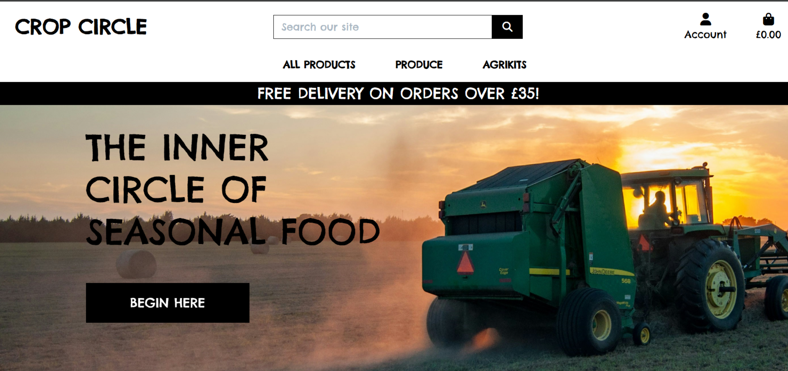

# Crop Circle E-Commerce Website by Alex Gordon

## Content List
- [Crop Circle](#crop-circle-e-commerce-site)
- [User Story](#user-story)
- [How to Create a Django Project](#how-to-create-a-django-project)
- [Features](#features)
- [Database](#database)
- [Technology](#technology)
- [Deployment and Local Development](#deployment-and-local-development)
- [Credits](#credits)

## Crop Circle E-commerce site

### Project Goals

The primary goal of this e-commerce website is to provide a user-friendly platform where customers can effortlessly discover and purchase seasonal food and home gardening equipment to grow their own produce. By streamlining the shopping experience with intuitive navigation and smart search features, the website aims to save time and enhance customer satisfaction. Additionally, the project seeks to inspire and empower individuals to embrace sustainable living by nurturing their green thumbs through easy access to quality gardening tools and resources. Ultimately, this platform aspires to build a community of eco-conscious individuals, fostering a love for home gardening and fresh, seasonal produce.

## User Story

| User Story ID | As a/an | I want to be able to ... | So that I can... |
| :--- | :--- | :--- | :---|
| **VIEWING & NAVIGATION** |
| 1 | Shopper | View a list of products| Select something to purchase |
| 2 | Shopper | View a specific category of products | Quickly find products I'm interested in without having to search through all products |
| 3 | Shopper | View individual product details | Identify the price, description, product rating, product image |
| 4 | Shopper| Quickly identify other types of products available on the site | Take advantage of a good selection of products I'd like to purchase |
| 5 | Shopper | Easily view the total of my purchases at any time | Avoid spending too much |
| **REGISTRATION & USER ACCOUNTS** |
| 6 | Site User | Easily register for an account| Have a personal account and be able to view my profile |
| 7 | Site User | Easily log in or out | Access my personal account information |
| 8 | Site User | Easily recover my password in case I forget it | Recover access to my account |
| 9 | Site User | Receive an email confirmation after registering | Verify that my account registration was successful |
| 10 | Site User | Have a personalised user profile | View my personal order history and order confirmations, and save my payment information |
| **SORTING & SEARCHING** |
| 11 | Shopper | Sort the list of available products | Easily identify the best rated, best priced and categorically sort products |
| 12 | Shopper | Sort a specific category of product | Find the best-priced or best-rated product in a specific category, or sort the products in that category by name |
| 13 | Shopper | Sort multiple categories of products simultaneously | Find the best-priced or best-rated products across broad categories |
| 14 | Shopper | Search for a product by name or description | Find a specific product I'd like to purchase |
| 15 | Shopper | Easily see what I've searched for and the number of results | Quickly decide whether the product I want is available |
| **PURCHASING & CHECKOUT** |
| 16 | Shopper | Easily select the quantity of a product when purchasing it | Ensure I don't accidentally select the wrong product or quantity |
| 17 | Shopper | View items in my bag to be purchased | Identify the total cost of my purchase and all items I will receive |
| 18 | Shopper | Adjust the quantity of individual items in my bag| Easily make changes to my purchase before checkout |
| 19 | Shopper | Easily enter my payment information | Check out quickly and with no hassles |
| 20 | Shopper | Feel my personal and payment information is safe and secure | Confidently provide the needed information to make a purchase |
| 21 | Shopper | View an order confirmation after checkout | Verify that I haven't made any mistakes |
| 22 | Shopper | Receive an email confirmation after checking out | Keep the confirmation of what I've purchased for my records |
| **ADMIN & STORE MANAGEMENT** |
| 23 | Store Owner | Add a product| Add new items to my store |
| 24 | Store Owner | Edit/update a product | Change product prices, descriptions, images and other product criteria |
| 25 | Store Owner | Delete a product | Remove items that are no longer for sale |

## How to Create a Django Project

Step-by-Step Guide:

 1\. Create a Django Project

- Install Django (if not already installed): 'pip install django'

Or, for Python 3: pip3 install django

- Create a new Django project: 'django-admin startproject myproject'

'cd myproject' This will create a myproject folder with the necessary Django files.

2\. Create a Django App

Django projects are made up of apps. Here’s how to create one:

- Create a new app (e.g., myapp): 'python manage.py startapp myapp'

This will create a new folder called myapp containing the basic structure of a Django app.

- Add the app to the project’s INSTALLED\_APPS:

Open myproject/settings.py and add 'myapp' to the INSTALLED\_APPS list:

INSTALLED\_APPS = \[\# other apps 'myapp', \]

3\. Install Packages (e.g., django-countries)

Let’s install a package like django-countries to use in the app.

- Install the package using pip: 'pip install django-countries'

Or for Python 3: 'pip3 install django-countries'

This will install django-countries in your environment.

4\. Add the Package to INSTALLED\_APPS (if needed)

Some packages require you to add them to INSTALLED\_APPS in your settings.py. For django-countries, you don’t need to add it explicitly, but let’s say you're using it with a model field, ensure that any custom apps that use the package are added to INSTALLED\_APPS.

Example:

INSTALLED\_APPS = \[\# other apps'django\_countries',\]

5\. Create Models in myapp/models.py

Now that you have an app and a package, let’s define some models.

- Open myapp/models.py and create a simple model. For example:

from django.db import models

from django\_countries.fields import CountryField

class Customer(models.Model):

name = models.CharField(max\_length=100)

country = CountryField(blank\_label='(Select country)')

def \_\_str\_\_(self):

return self.name

6\. Make Migrations

After defining models, you need to create migrations to update the database.

- Run the following command to generate migration files: 'python manage.py makemigrations'

This will create migration files in the migrations/ folder within your app (myapp).

7\. Dry Run Database Migration with --dry-run Flag

To check what changes will be applied to your database without actually applying them, use the --dry-run flag.

- Run the following command: python manage.py migrate --dry-run

This will show the SQL queries that would be executed but won’t actually make any changes to the database.

8\. Plan Database Migration with --plan Flag

To see a detailed breakdown of the migration plan, use the --plan flag.

- Run the following command: 'python manage.py migrate --plan'

This will show a plan of what migrations will be applied, including dependencies and operations like creating or modifying tables.

9\. Apply Migrations to the Database

Once you're ready to apply the migrations to your database, run the following:

- Run migrations: 'python manage.py migrate'

This will apply the pending migrations to the database.

10\. Verify the Migration

Once the migration has been applied, you can verify that the changes were successful by checking the database or running the following:

- Check for tables created or updated by migrations: 'python manage.py showmigrations'

This will list all migrations and their statuses.

Extra Notes:

Virtual Environments: If you're working within a virtual environment (recommended), make sure it’s activated before running the commands. Create and activate it using the following:

'python3 -m venv venv'

'source venv/bin/activate' # On Unix/macOS

'venv\\Scripts\\activate' # On Windows

Postgres or Other Database: If you're using PostgreSQL, MySQL, or another database, make sure your DATABASES settings in settings.py are configured correctly before running migrations.

### Interface and Navigation Design

The interface and navigation design of the app have been carefully crafted to ensure a seamless experience across both mobile and desktop devices. By incorporating a responsive design, the app adjusts to different screen sizes, providing a consistent and user-friendly experience on any device. The main navigation menu is easy to access and intuitive, offering quick access to key sections of the site while maintaining a clean and uncluttered layout. 

## Features 

#### User Authentication and Authorisation
- User Registration
- User login with email confirmation
- User logout

#### User Profile
- Order history
- Order email confirmation
- Save delivery information

#### Store Management
- Add product
- Edit product
- Delete product

#### List of Products
- All products
- Spring and Summer Produce
- Autumn and Winter Produce
- Preserves
- Grow Kits
- Harvest Kits
- Grow Tech

#### Product Details
- Product category(clickable)
- Product price
- Product rating
- Product image
- Product Description
- Product Quantity
- Add to bag button

#### Search
- Search by keywords in the product name and description

#### Sorting
- Sort by price (ascending and descending)
- Sort by rating (ascending and descending)
- Sort by name (ascending and descending)
- Sort by category (ascending and descending)

#### Shopping Bag
- Add product to bag
- Remove a product from the bag
- View bag
- View and adjust the number of each product in the bag
- View a subtotal cost of each product in the bag
- Delivery calculation
- Grand total

#### Checkout (Stripe)
- Checkout form with delivery information
- Card payment

#### Test card numbers for Stripe
https://stripe.com/docs/testing?testing-method=card-numbers

Successful payment
- `4242424242424242`

Declined payments
- `4000000000000002` - card declined
- `4000000000009995` - insufficient funds
- `4000000000009987` - lost card
- `4000000000009979` - stolen card

3D Secure
- `4000002500003155` - 3D Secure authentication required

## Testing

Lighthouse report in Developement

## Database

I have decided to use a Relational database schema for this project.

A relational database is a type of database that organizes data into structured tables, called relations, where each table consists of rows (records) and columns (fields). These tables are connected through relationships, which are often established using keys:

Primary Key: A unique identifier for each record in a table.
Foreign Key: A column in one table that references the primary key in another table, creating a relationship between them.
Relational databases use SQL (Structured Query Language) to query, manage, and manipulate the data. They are ideal for handling structured data with clear relationships, like in applications such as banking systems, customer management, and e-commerce platforms.

Popular relational database systems include MySQL, PostgreSQL, Oracle Database, and Microsoft SQL Server.

## Technology
+ This website was made in its entirety using Visual Code Studio
+ Additional software used to create this website include Chrome for previewing, inspecting and bug testing
+ Json formatter https://jsonformatter.com/ 
+ Code languages used in this project are as follows:
    + HTML for the structure of the webpage 
    + CSS for the styling 
    + Javascript for the interactivity
    + Python
    + PostgreSQL for Database
    + Django 
    + Django Allauth
    + Flake8 for code formatting
    + AWS S3 for Media storage
    + Stripe for payments

 
## Deployment and Local Development

### Deployment

The site is deployed using Heroku.

To deploy my app from GitHub to Heroku, I first ensured that my project was connected to a GitHub repository. After making the necessary changes to the code and committing them locally, I pushed the updates to the GitHub repository using the git push command. Next, I logged into my Heroku account through the Heroku CLI and linked the app to the appropriate GitHub repository by navigating to the Heroku dashboard, selecting the app, and linking it under the "Deploy" tab. I then set up automatic deployment, ensuring that every time changes were pushed to the GitHub repository, they would automatically trigger a new deployment on Heroku. For manual deployment, I used the Heroku CLI, running the command git push heroku main, which pushed the latest changes from the main branch of GitHub to Heroku. Once the push was complete, Heroku automatically built and deployed the app, and I could check the deployment status through the Heroku dashboard. This process ensured that my app was always up to date and successfully deployed.

### Local Development

#### How to Fork

To fork the repository:

1. Log in (or sign up) to Github.
2. Go to the repository for this project, [Al3x-G/Crop_Circle](https://github.com/Al3x-G/Crop_Circle).
3. Click the Fork button in the top right corner.

#### How to Clone

To clone the repository:

1. Log in (or sign up) to GitHub.
2. Go to the repository for this project, [Al3x-G/Crop_Circle](https://github.com/Al3x-G/Crop_Circle).
3. Click on the code button, select whether you would like to clone with HTTPS, SSH or GitHub CLI and copy the link shown.
4. Open the terminal in your code editor and change the current working directory to the location you want to use for the cloned directory.
5. Type 'git clone' into the terminal and then paste the link you copied in step 3. Press enter.

The Visual Studio Code preview extension was used to preview the website. To open this repository on Visual Studio Code:

+ Open an integrated terminal from the menu Terminal -> New Terminal
+ Clone the repo with the following command: git clone https://github.com/Al3x-G/Crop_Circle
+ Change your terminal into that new subdirectory: cd Crop_Circle
+ Open in Visual Studio Code: code .

## Credits
### Text Content
Text is written by the author https://github.com/Al3x-G

### Images
Images were all license free from [Unsplash](https://unsplash.com/) and [Pexel](https://www.pexels.com/)

### Code

All code was written by Alex Gordon working alongside Code Institute for support and guidance.

### Special mention

Code Institute for their continued support during this process of learning 